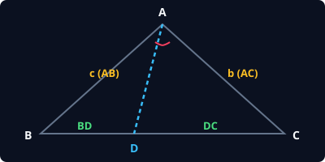
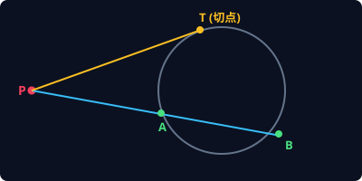
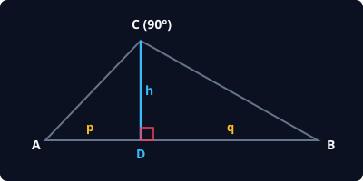

# 📐 平面几何 5 大必考公式与定理速查

---

### 1. 角平分线定理（Angle Bisector Theorem）



* **定理内容**：在 $\triangle ABC$ 中，$AD$ 是 $\angle A$ 的内角平分线，交 $BC$ 于 $D$。则两边之比严格等于对边两段之比：

```math
\frac{BD}{DC} = \frac{AB}{AC} = \frac{c}{b}
```

* **外角平分线推广**：若 $AE$ 为外角平分线交 $BC$ 延长线于 $E$，同样满足：

```math
\frac{BE}{EC} = \frac{AB}{AC}
```

* **秒杀考点**：遇到“角平分线 + 给出若干边长”，第一反应列比例方程，绝不要作复杂辅助线！

---

### 2. 圆幂定理（Power of a Point Theorem）



* **定理内容**：过圆外一点 $P$ 作割线 $PAB$ 和切线 $PT$（或两相交割线 $PAB, PCD$）：

```math
PT^2 = PA \cdot PB = PC \cdot PD
```

* **相交弦定理（圆内）**：若两条弦 $AB, CD$ 相交于圆内一点 $P$，同样恒有：

```math
PA \cdot PB = PC \cdot PD
```

* **秒杀考点**：圆内求某段未知弦长，只要找到交点，两段乘积必相等！

---

### 3. 直角三角形射影定理（Geometric Mean Theorem）



* **定理内容**：在直角 $\triangle ABC$ 中，$\angle C = 90^\circ$，$CD \perp AB$ 于 $D$（设 $CD = h, AD = p, BD = q$）：

```math
h^2 = p \cdot q
```

```math
AC^2 = p \cdot c, \quad BC^2 = q \cdot c
```

* **秒杀考点**：高线是两段射影的比例中项；每一条直角边是它在斜边上的射影与整个斜边的比例中项。

---

### 4. 鞋带公式（Shoelace Formula，坐标几何大杀器）

* **应用场景**：已知平面直角坐标系中任意多边形顶点的坐标 $(x_1, y_1), (x_2, y_2), \dots, (x_n, y_n)$，求多边形面积。
* **公式**：按逆时针排列顶点：

```math
\text{Area} = \frac{1}{2} \left| (x_1 y_2 + x_2 y_3 + \dots + x_n y_1) - (y_1 x_2 + y_2 x_3 + \dots + y_n x_1) \right|
```

* **秒算示例**：已知三角形三顶点为 $(0,0), (4,2), (1,5)$：
  * 正对角线和：$0\times 2 + 4\times 5 + 1\times 0 = 20$
  * 反对角线和：$0\times 4 + 2\times 1 + 5\times 0 = 2$
  * $\text{Area} = \frac{1}{2} |20 - 2| = \mathbf{9}$（15 秒出答案，绝不用割补法）

---

### 5. 托勒密定理（Ptolemy's Theorem，圆内接四边形压轴）

* **定理内容**：圆内接四边形 $ABCD$ 中，**两对角线之积 = 两组对边乘积之和**：

```math
AC \cdot BD = AB \cdot CD + BC \cdot AD
```

* **常考题型**：圆内接梯形、圆内接正五边形/正八边形求特定对角线长度。
