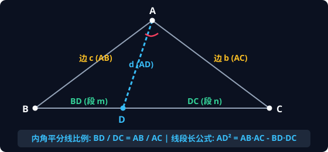
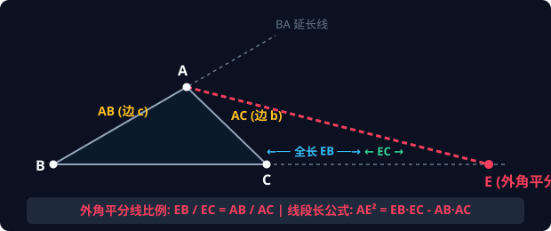
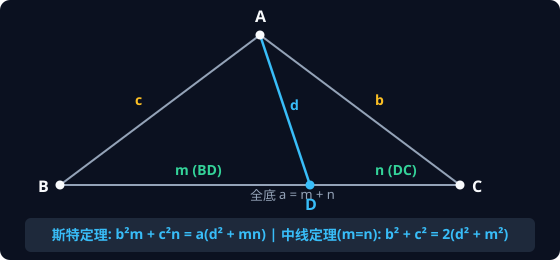
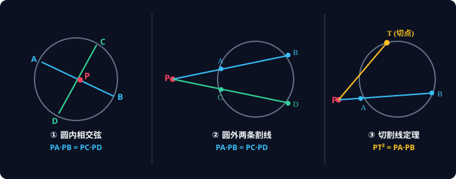
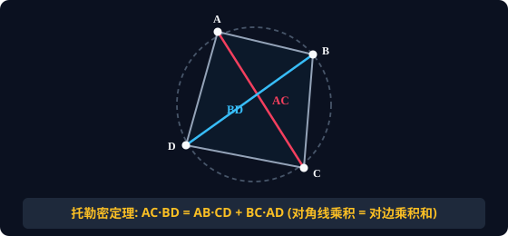
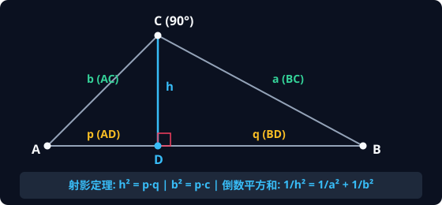
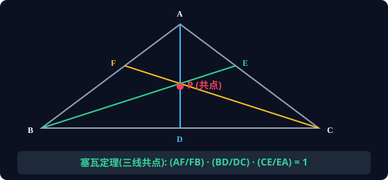

# 📐 AMC 10 平面几何集大成大师手册：五大母定理、全域变式与实战秒杀

> **致未来的顶尖极客与学者**：  
> 几何学的本质不是死记硬背公式，而是**“在千变万化的图形中，一眼洞穿最底层的对称性与不变量”**。  
> 本手册不惜笔墨，将 AMC 10 最核心的五大几何母定理及其衍生拓展彻底展开。包含**严谨双向证明**、**矢量高清图解**、**全套引申推广**与**AMC 10 / AIME 实战秒杀题型**。读透本篇，你的几何思维将实现从“解题”到“俯视”的质的飞跃！

---

## 📚 全景知识树导航

```
平面几何核心体系
├── 1. 角平分线双星体系 ── 比例定理 ─┬─ 面积法/相似法证明
│                                     ├─ 外角平分线推广 (调和点列)
│                                     ├─ 阿波罗尼斯圆 (轨迹极值)
│                                     └─ 角平分线自身长度公式 (内外双生)
│
├── 2. 斯特瓦尔特定理家族 ── 万能线段长 ┬─ 余弦定理证明
│                                       ├─ 阿波罗尼奥斯中线定理
│                                       ├─ 三中线平方和与重心定理
│                                       └─ 平行四边形对角线恒等式
│
├── 3. 圆幂定理不变量族 ── 点对圆的幂 ─┬─ 相交弦 / 双割线 / 切割线
│                                     ├─ 根轴定理 (两圆公共弦本质)
│                                     └─ 三圆根心定理 (三公共弦必共点)
│
├── 4. 托勒密与多边形网络 ── 对角线乘积 ┬─ 相似三角形构造证明
│                                       ├─ 广义托勒密不等式 (共圆判定)
│                                       ├─ 正多边形黄金分割与对角线方程
│                                       └─ 三角函数正弦和角公式的几何推导
│
├── 5. 射影定理与高线面积群 ── 双直角相似 ┬─ 高线倒数平方和定理
│                                         ├─ 算几不等式 (AM-GM) 纯几何图解
│                                         ├─ 海伦公式与面积三态
│                                         └─ 内切圆与外接圆半径公式全集
│
└── 6. 塞瓦与梅涅劳斯顶峰 ── 共点与共线 ┬─ 塞瓦定理 (三中线/三高/三角平分线共点)
                                       └─ 梅涅劳斯定理 (截线比例闭环)
```

---

## 1. 角平分线双星体系（从比值到长度，再到阿波罗尼斯圆）

### 1.1 【母定理】内角平分线定理 (Internal Angle Bisector)



在 $\triangle ABC$ 中，$AD$ 为 $\angle A$ 的内角平分线，交对边 $BC$ 于点 $D$。记 $AB=c, AC=b, BD=m, DC=n$。  
则**对边被分成的两段之比，严格等于相邻两边之比**：

$$
\frac{BD}{DC} = \frac{AB}{AC} \iff \frac{m}{n} = \frac{c}{b}
$$

#### 🔍 经典证明方法（领悟几何构造的两种美）

* **证明法一（面积法 —— 竞赛中最快最透彻的方法）**：  
  点 $D$ 在 $\angle A$ 的平分线上，由角平分线性质，点 $D$ 到两边 $AB, AC$ 的垂直距离相等，记为 $h_0$。  
  同时，$\triangle ABD$ 与 $\triangle ACD$ 共顶点 $A$，在底边 $BC$ 上的高相同，记为 $H$。  
  列出两三角形面积之比的两种表达方式：
  $$ \frac{\text{Area}(\triangle ABD)}{\text{Area}(\triangle ACD)} = \frac{\frac{1}{2} \cdot c \cdot h_0}{\frac{1}{2} \cdot b \cdot h_0} = \frac{c}{b} $$
  $$ \frac{\text{Area}(\triangle ABD)}{\text{Area}(\triangle ACD)} = \frac{\frac{1}{2} \cdot BD \cdot H}{\frac{1}{2} \cdot DC \cdot H} = \frac{BD}{DC} $$
  两式联立，瞬间得证 $\frac{BD}{DC} = \frac{c}{b}$！$\blacksquare$

* **证明法二（平行相似法 —— 掌握辅助线技巧）**：  
  过点 $C$ 作 $CE \parallel AD$ 交 $BA$ 的延长线于点 $E$。  
  因为 $AD \parallel CE$，所以 $\angle ACE = \angle CAD = \angle BAD = \angle AEC$。  
  从而 $\triangle ACE$ 是等腰三角形，即 $AE = AC = b$。  
  在 $\triangle BCE$ 中由平行线截线定理：$\frac{BD}{DC} = \frac{AB}{AE} = \frac{c}{b}$。证毕！$\blacksquare$

---

### 1.2 【神级推广一】外角平分线定理 (External Angle Bisector)



在 $\triangle ABC$ 中，延长 $BA$ 至 $A'$，作外角 $\angle A'AC$ 的平分线交 $BC$ 的延长线于点 $E$。  
则该外分点 $E$ 同样严格满足两边之比：

$$
\frac{EB}{EC} = \frac{AB}{AC} = \frac{c}{b}
$$

* **记忆关键点**：分子是**交点到端点 $B$ 的全长 $EB$**，分母是**交点到端点 $C$ 的外段 $EC$**！

---

### 1.3 【举一反三】调和点列与阿波罗尼斯圆 (Apollonius Circle)

把内角平分线交点 $D$ 与外角平分线交点 $E$ 放在一起观察：

$$
\frac{BD}{DC} = \frac{EB}{EC} = \frac{AB}{AC} = k \quad (k \ne 1)
$$

这意味着：**点 $D$（内分点）与点 $E$（外分点）关于线段 $BC$ 形成调和共轭（Harmonic Conjugate）！**

> 💡 **阿波罗尼斯轨迹定理**：  
> 平面上所有到两个定点 $B, C$ 的距离之比等于常数 $k = \frac{c}{b} \ne 1$ 的动点 $P$ 的轨迹，**是一个圆**！  
> **极客速记**：这个圆的直径两个端点，恰恰就是内分点 $D$ 和外分点 $E$！  
> * 圆心即为线段 $DE$ 的中点。  
> * 直径即为 $DE$ 的长度。  
> **AMC 10 考法**：题目若给出 $PB : PC = 2 : 1$，求点 $P$ 移动时 $\triangle PBC$ 面积的最大值。直接以 $DE$ 为直径作阿波罗尼斯圆，圆最高点的垂直高度即为最大高！

---

### 1.4 【神级推广二】角平分线自身长度公式（免做辅助线秒杀）

AMC 10 经常给出三边长，要求计算角平分线自身的长度。传统方法用余弦定理极度繁琐，记住以下乘积差公式：

* **内角平分线长公式**：
$$
AD^2 = AB \cdot AC - BD \cdot DC = bc - mn
$$

* **外角平分线长公式（对称镜像）**：
$$
AE^2 = EB \cdot EC - AB \cdot AC
$$

* **三角半角纯边长展开式**：
$$
AD = \frac{2bc \cos(A/2)}{b + c}
$$

> 🎯 **实战秒杀示范 (AMC 10 真题模型)**：  
> $\triangle ABC$ 中，$c = AB = 6, b = AC = 4, a = BC = 5$。求内角平分线 $AD$ 的长。  
> 1. 由内角平分线定理：$m : n = 6 : 4 = 3 : 2 \implies m = 3, n = 2$。  
> 2. 套入长度公式：$AD^2 = bc - mn = (6 \times 4) - (3 \times 2) = 24 - 6 = 18$。  
> 3. 直接得出 $AD = \sqrt{18} = 3\sqrt{2}$！整道题 10 秒解完。

---

## 2. 斯特瓦尔特定理家族（线段长计算的终极核武器）

### 2.1 【母定理】斯特瓦尔特定理 (Stewart's Theorem)



在 $\triangle ABC$ 中，$D$ 为底边 $BC$ 上**任意一点**。记 $BC=a, AC=b, AB=c, AD=d, BD=m, DC=n$（满足 $a = m + n$）。则恒有：

$$
b^2 m + c^2 n = a (d^2 + mn)
$$

* **国际奥数通用记忆口诀**：  
  *"A man and his dad put a bomb in the sink."*  
  $\implies man + dad = bmb + cnc \iff a(d^2 + mn) = b^2 m + c^2 n$

#### 🔍 纯数学推导（余弦互补角法）
在 $\triangle ABD$ 与 $\triangle ACD$ 中，$\angle ADB$ 与 $\angle ADC$ 互为邻补角，即 $\cos \angle ADB + \cos \angle ADC = 0$。  
由余弦定理分别列出两角的余弦：
$$ \cos \angle ADB = \frac{d^2 + m^2 - c^2}{2dm}, \quad \cos \angle ADC = \frac{d^2 + n^2 - b^2}{2dn} $$
代入互补条件 $\frac{d^2 + m^2 - c^2}{2dm} + \frac{d^2 + n^2 - b^2}{2dn} = 0$，通分化简即得斯特定理！$\blacksquare$

---

### 2.2 【神级推广一】阿波罗尼奥斯中线定理 (Apollonius's Theorem)

当点 $D$ 恰好为 $BC$ 的**中点**时，即 $m = n = \frac{a}{2}$。斯特定理两边消去 $\frac{a}{2}$，瞬间导出：

$$
AB^2 + AC^2 = 2 \left(AD^2 + BD^2\right) \iff b^2 + c^2 = 2 \left(m_a^2 + \frac{a^2}{4}\right)
$$

由此得到**中线长万能公式**：

$$
m_a = \frac{1}{2} \sqrt{2b^2 + 2c^2 - a^2}
$$

> 💡 **几何内涵**：三角形任意两边的平方和，等于底边一半平方与中线平方和的两倍！

---

### 2.3 【神级推广二】平行四边形恒等式与重心坐标

1. **平行四边形对角线平方和定理**：  
   平行四边形的两条对角线互相平分。由中线定理直接可得：  
   **平行四边形两条对角线的平方和，严格等于四条边的平方和**：
   $$ AC^2 + BD^2 = 2(AB^2 + BC^2) $$

2. **三中线平方和与三边平方和的黄金比例**：  
   将三条中线 $m_a, m_b, m_c$ 的公式平方后相加，交叉项完美化简：
   $$ m_a^2 + m_b^2 + m_c^2 = \frac{3}{4} (a^2 + b^2 + c^2) $$
   *(三中线平方和永远等于三边平方和的 $\frac{3}{4}$！)*

3. **重心 $G$ 的线段比**：重心分每条中线为 $2 : 1$（$AG = \frac{2}{3} m_a$）。

---

## 3. 圆幂定理不变量族（点对圆的几何与代数守恒）



### 3.1 【母概念】点对圆的幂（Power of a Point）
设圆 $\omega$ 的圆心为 $O$，半径为 $R$。平面上任意一点 $P$ 与圆心距离为 $d = PO$。  
定义点 $P$ 关于圆 $\omega$ 的**圆幂值（Power）**为：

$$
\text{Pow}(P) = d^2 - R^2
$$

* 点 $P$ 在圆外 $\iff d > R \iff \text{Pow}(P) > 0$
* 点 $P$ 在圆上 $\iff d = R \iff \text{Pow}(P) = 0$
* 点 $P$ 在圆内 $\iff d < R \iff \text{Pow}(P) < 0$

无论点 $P$ 位于何处，过点 $P$ 引任意交圆于 $A, B$ 的直线，其**有向距离之积恒等于该点的圆幂**！

---

### 3.2 三大几何形态详解

#### ① 圆内相交弦定理 (Intersecting Chords Theorem)
点 $P$ 在圆内，弦 $AB$ 与弦 $CD$ 相交于点 $P$：
$$
PA \cdot PB = PC \cdot PD = R^2 - d^2
$$
* **证明核心**：同弧所对圆周角相等 $\implies \angle A = \angle D, \angle C = \angle B \implies \triangle PAC \sim \triangle PDB$。

#### ② 圆外两条割线定理 (Secant-Secant Theorem)
点 $P$ 在圆外，引割线 $PAB$ 和 $PCD$：
$$
PA \cdot PB = PC \cdot PD = d^2 - R^2
$$

#### ③ 切割线定理 (Tangent-Secant Theorem)
切线是割线的极限形态（割线两交点重合为切点 $T$）：
$$
PT^2 = PA \cdot PB = PC \cdot PD = d^2 - R^2
$$

---

### 3.3 【顶阶拓展】根轴定理与三圆根心 (Radical Axis & Center)

> 💡 **竞赛高分秘钥（彻底搞懂两圆相交题）**：  
> * **根轴 (Radical Axis)**：平面上到两个圆圆幂相等的点集，是一条**垂直于两圆连心线的直线**！  
>   * 如果两圆相交，**两圆公共弦所在直线就是它们的根轴**！  
>   * 如果从根轴上任意一点向两个圆分别引切线，切线长相等！  
> * **根心 (Radical Center)**：平面上有三个圆，两两的根轴（若不平行）**必交于唯一一点，称为根心**！  
>   * **应用**：若三圆两两相交，它们的三条公共弦必相交于同一个点！

---

## 4. 托勒密定理与正多边形拓展（四边形的最高乘积法则）



### 4.1 【母定理】托勒密定理 (Ptolemy's Theorem)

对于任意**圆内接四边形** $ABCD$：**两条对角线的乘积，等于两组对边乘积之和**：

$$
AC \cdot BD = AB \cdot CD + BC \cdot AD
$$

#### 🔍 经典几何构造证明（绝妙相似三角形）
在对角线 $BD$ 上取一点 $E$，使得 $\angle DAE = \angle CAB$。  
1. 因为同弧所对圆周角 $\angle ADE = \angle ACB$，所以 $\triangle ADE \sim \triangle ACB$：  
   $$ \frac{ED}{BC} = \frac{AD}{AC} \implies ED \cdot AC = BC \cdot AD $$
2. 另一方面，$\angle BAE = \angle BAC + \angle CAE = \angle DAE + \angle CAE = \angle CAD$；  
   且圆周角 $\angle ABE = \angle ACD$。因此 $\triangle ABE \sim \triangle ACD$：  
   $$ \frac{BE}{CD} = \frac{AB}{AC} \implies BE \cdot AC = AB \cdot CD $$
3. 将两式相加：  
   $$ (BE + ED) \cdot AC = AB \cdot CD + BC \cdot AD \iff BD \cdot AC = AB \cdot CD + BC \cdot AD $$
证毕！$\blacksquare$

---

### 4.2 【神级推广一】广义托勒密不等式 (Ptolemy's Inequality)

对于平面上**任意**凸四边形 $ABCD$（不要求共圆）：

$$
AC \cdot BD \le AB \cdot CD + BC \cdot AD
$$

* **等号成立条件**：当且仅当 $A, B, C, D$ 四点共圆且按圆周顺序排列！  
* **竞赛实战价值**：常用于求点到三角形三顶点距离加权和的最小值问题。

---

### 4.3 【神级推广二】正多边形中的黄金分割秒杀

正多边形所有顶点天然共圆，是托勒密定理的最完美舞台：

#### ① 正五边形与黄金分割比
在边长为 $1$ 的正五边形 $ABCDE$ 中，连结对角线 $AC, BD$。  
由对称性，所有对角线长度均相等，设为 $d$。  
考察圆内接四边形 $ABCD$：边长 $AB=1, BC=1, CD=1$，对角线 $AC=d, BD=d, AD=d$。  
代入托勒密定理：
$$ d \cdot d = 1 \cdot 1 + 1 \cdot d \iff d^2 - d - 1 = 0 $$
因为 $d > 0$，直接解得正五边形对角线长：
$$ d = \frac{1 + \sqrt{5}}{2} \approx 1.618 \quad \text{(黄金分割比！)} $$

#### ② 正七边形倒数和定理（AIME / 高联经典）
在边长为 $a$ 的正七边形中，较短对角线为 $b$，较长对角线为 $c$。选定特定四顶点列托勒密方程，直接导出世界名题恒等式：
$$ \frac{1}{a} = \frac{1}{b} + \frac{1}{c} $$

---

### 4.4 【神级推广三】几何推导三角和角公式
在直径为 $1$ 的圆中，作圆内接四边形，以直径为一条对角线，利用托勒密定理，可以纯几何瞬间证明正弦和角公式：
$$ \sin(\alpha + \beta) = \sin\alpha \cos\beta + \cos\alpha \sin\beta $$

---

## 5. 直角三角形射影定理与高线面积群



### 5.1 【母定理】射影定理（双直角全相似模型）

在 Rt$\triangle ABC$ 中，$\angle C = 90^\circ$，$CD \perp AB$ 于 $D$。记 $BC=a, AC=b, AB=c, CD=h, AD=p, BD=q$（满足 $p + q = c$）。  
三个直角三角形 $\triangle ACD \sim \triangle CBD \sim \triangle ABC$ 全部互相相似！导出：

$$
h^2 = p \cdot q \quad \text{(高是两段射影的几何平均)}
$$
$$
b^2 = p \cdot c, \quad a^2 = q \cdot c \quad \text{(直角边是射影与斜边的几何平均)}
$$

---

### 5.2 【神级推广一】斜边高的倒数平方和定理（AMC 10 超高频）

由面积恒等式 $a \cdot b = c \cdot h \implies h = \frac{ab}{c}$，结合勾股定理 $c^2 = a^2 + b^2$：

$$
\frac{1}{h^2} = \frac{c^2}{a^2 b^2} = \frac{a^2 + b^2}{a^2 b^2} = \frac{1}{a^2} + \frac{1}{b^2}
$$

$$
\frac{1}{h^2} = \frac{1}{a^2} + \frac{1}{b^2}
$$

> 💡 **三维空间大推广（三直角四面体）**：  
> 若一个四面体 $O-ABC$ 的三个面角 $\angle AOB = \angle BOC = \angle COA = 90^\circ$，$h$ 为原点 $O$ 到底面 $ABC$ 的高：  
> 其三条直角棱 $OA=a, OB=b, OC=c$ 同样满足惊人对称的公式：
> $$ \frac{1}{h^2} = \frac{1}{a^2} + \frac{1}{b^2} + \frac{1}{c^2} $$

---

### 5.3 【极客直觉】算术-几何平均不等式 (AM-GM) 的纯几何直观解释

在直径为 $c = p + q$ 的半圆中，直角顶点 $C$ 在圆弧上：
* 半径长为：$\frac{p + q}{2}$（算术平均值 Arithmetic Mean）；
* 从切分点作垂直弦，由射影定理，半弦长为：$h = \sqrt{pq}$（几何平均值 Geometric Mean）。
* 因为半弦长永远不可能超过圆半径（垂线段短于等于斜线段）：
$$ \frac{p + q}{2} \ge \sqrt{pq} $$
等号成立当且仅当垂线经过圆心，即 $p = q$！用纯几何图解彻底想通代数不等式！

---

### 5.4 【面积与切圆半径全家桶】

* **直角三角形内切圆半径速算**：
$$ r = \frac{a + b - c}{2} $$
* **任意三角形内切圆半径（周长模型）**：
$$ \text{Area} = r \cdot s \quad \left(s = \frac{a + b + c}{2} \text{ 为半周长}\right) \implies r = \frac{\text{Area}}{s} $$
* **任意三角形外接圆半径（正弦定理推广）**：
$$ R = \frac{abc}{4 \cdot \text{Area}} $$
* **海伦公式（Heron's Formula，纯已知三边求面积）**：
$$ \text{Area} = \sqrt{s(s - a)(s - b)(s - c)} $$

---

## 6. 塞瓦定理与梅涅劳斯定理（共点共线的最高法则）



### 6.1 【母定理 1】塞瓦定理 (Ceva's Theorem —— 判断三线共点)

在 $\triangle ABC$ 中，$D, E, F$ 分别是边 $BC, CA, AB$ 上的点。  
三条塞瓦线 $AD, BE, CF$ **交于同一点 $P$ 的充要条件是**：

$$
\frac{AF}{FB} \cdot \frac{BD}{DC} \cdot \frac{CE}{EA} = 1
$$

* **三心共点的统一秒证**：
  * **三条中线必交于重心**：因为各边中点比例全为 $1$，乘积必为 $1 \times 1 \times 1 = 1$；
  * **三条内角平分线必交于内心**：由角平分线定理代入比值：$\frac{c}{b} \cdot \frac{a}{c} \cdot \frac{b}{a} = 1$，直接秒证共点！

---

### 6.2 【母定理 2】梅涅劳斯定理 (Menelaus's Theorem —— 判断三点共线)

若一条直线（截线）交 $\triangle ABC$ 的边 $BC, CA, AB$（或其延长线）于点 $D, E, F$。  
则 **$D, E, F$ 三点共线的充要条件是**：

$$
\frac{AF}{FB} \cdot \frac{BD}{DC} \cdot \frac{CE}{EA} = 1
$$

* **记忆口诀（塞瓦与梅氏全通用）**：  
  *“顶到分，分到顶；绕着三边转一圈，顺次乘积等于 1！”*

---

## 7. 考场“几何见条件反射图谱”（考场 3 秒锁定解题工具）

| 题目给出的特征几何信息 | 脑海中第一反应调用的定理工具 | 关键算式 |
| :--- | :--- | :--- |
| 给出 **角平分线 + 若干边长** | 内角/外角平分线定理 | $\frac{m}{n} = \frac{c}{b}$，长度 $AD^2 = bc - mn$ |
| 给出 **底边上线段分点，求线段长** | 斯特瓦尔特定理 (Stewart) | $b^2 m + c^2 n = a(d^2 + mn)$ |
| 给出 **三角形中线，求边长或中线** | 阿波罗尼奥斯中线定理 | $b^2 + c^2 = 2(m_a^2 + a^2/4)$ |
| 给出 **圆 + 两条相交直线 / 切线** | 圆幂定理 (Power of a Point) | $PA \cdot PB = PC \cdot PD = PT^2$ |
| 给出 **圆内接四边形对角线 / 边长** | 托勒密定理 (Ptolemy) | $AC \cdot BD = AB \cdot CD + BC \cdot AD$ |
| 给出 **正五边形 / 正多边形求对角线** | 托勒密构造二次方程 | $d^2 - d - 1 = 0 \implies d = \frac{\sqrt{5}+1}{2}$ |
| 给出 **平面直角坐标系中的多边形顶点** | 鞋带公式 (Shoelace Formula) | $\frac{1}{2} | \sum (x_i y_{i+1} - x_{i+1} y_i) |$ |
| 给出 **直角三角形斜边高** | 射影定理与倒数平方和 | $h^2 = pq, \quad \frac{1}{h^2} = \frac{1}{a^2} + \frac{1}{b^2}$ |
| 给出 **三角形内三线交于一点 / 三点共线**| 塞瓦定理 / 梅涅劳斯定理 | 环绕三比值之积恒为 1 |
